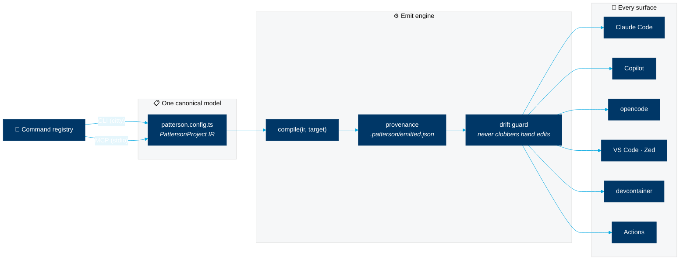

<div align="center">


<picture>
  <source media="(prefers-color-scheme: dark)" srcset="https://raw.githubusercontent.com/Patterson-Agents/design-system/main/assets/brand/patterson-logo-white.svg">
  <source media="(prefers-color-scheme: light)" srcset="https://raw.githubusercontent.com/Patterson-Agents/design-system/main/assets/brand/patterson-logo-navy.svg">
  
</picture>

<br><br>

# `patterson`

**One command. Every agent configured. Zero drift.**

A template-driven scaffolder *and* a standing configuration manager for the
AI-assisted development lifecycle — agents, editors, skills, plugins, MCP servers,
CI standards, and a built-in AI-fluency tutor.

<br>

[](https://bun.com)
[](https://www.typescriptlang.org)
[](https://modelcontextprotocol.io)
[](specs/001-patterson-cli-v1/spec.md)
[](#roadmap)

<br>

```sh
bun create patterson-agents/cli
```

</div>

---

## Why patterson?

Every AI coding tool reinvents the same concepts with incompatible file formats.
Your *instructions* live in `CLAUDE.md`, `AGENTS.md`, `.github/copilot-instructions.md`,
and Zed's `.rules` — four files, one idea, guaranteed drift. Your *MCP servers* are
declared in `.mcp.json`, `.vscode/mcp.json`, `opencode.json`, and Zed's
`context_servers` — four shapes, six transport enums, four secret syntaxes.

**patterson holds one canonical model and compiles it to every surface** — then keeps
watching, so hand edits are never lost, drift is always reported, and "add an MCP
server everywhere" is one command instead of four file edits.

<table>
<tr>
<td width="33%" valign="top">

### 🏗️ Scaffold

Pick one of **11 Patterson design-system templates** — docs sites, storefronts,
decks, corporate pages — and get a branded, agent-ready project in under a minute.
Fully offline. Non-empty dirs refused, never clobbered.

</td>
<td width="33%" valign="top">

### 🔁 Manage

`patterson.config.ts` is the single source of truth. `sync` re-emits every surface;
`doctor` reports drift; `check` shows exactly which intent reaches which agent —
and *why not* when a surface can't express it.

</td>
<td width="33%" valign="top">

### 🤖 Agent-native

The entire CLI is also a **stdio MCP server**. Any agent can drive every command —
prompts become structured decisions, destructive ops require explicit consent, and
nothing ever silently overwrites your edits.

</td>
</tr>
</table>

## Supported surfaces

| | Target | What patterson writes |
|---|---|---|
| 🟣 | **Claude Code** | `.claude/settings.json` · `CLAUDE.md` · `.mcp.json` · skills · agents · hooks · plugins |
| 🐙 | **GitHub Copilot** | `copilot-instructions.md` · `*.instructions.md` · `*.agent.md` · `*.prompt.md` · skills · coding-agent setup |
| ⚡ | **opencode** | `opencode.json` · `.opencode/agent` · commands · `skills.paths` wiring |
| 🖥️ | **VS Code** | `.vscode/mcp.json` · settings · extensions · tasks |
| ✨ | **Zed** | settings · instruction-chain conflict detection (yes, it catches your old `.cursorrules`) |
| 📦 | **Dev containers / Codespaces** | `devcontainer.json` · prebuild-aware lifecycle · badge |
| 🚀 | **GitHub Actions** | least-privilege workflows · release with provenance · supply-chain scanning |

## The command surface

```text
patterson create [dir]         Scaffold from a design-system template (the wizard)
patterson init [--import]      Adopt an existing repo — your config becomes the model
patterson sync                 Re-emit every surface from the model
patterson doctor [--fix]       Drift + validity report
patterson check                Which intent reaches which agent (coverage table)

patterson agents    list · add · remove · sync
patterson skills    list · search · add · remove · update      (skills.sh ecosystem)
patterson plugins   list · add · remove · marketplace …
patterson mcp       list · add · remove · serve                (serve = be an MCP server)
patterson design    templates · pull · refresh · tokens
patterson editor    vscode · zed · devcontainer · codespaces
patterson ci        init · add <workflow> · sync
patterson new       skill · mcp-server · plugin · claude-plugin · marketplace · command ·
                    cli-plugin · starlight-site · vitepress-site
patterson tutor     [topic] · list · resume · status
```

Every read takes `--json`. Every write takes `--dry-run` and `--yes`. Every prompt is
resolvable by a flag — interactive, CI, and agent callers share one code path.

## How it works



Three design rules make it trustworthy:

1. **Pure compilation** — every emitted file is a function of the model. Same model,
   same bytes, every time.
2. **Provenance everywhere** — sentinel blocks in markdown, key-path records for
   JSON/JSONC. If you hand-edit an emitted file, patterson *keeps your edit*, reports
   the conflict, and exits non-zero in automation. Overwriting requires
   `--accept-generated`. Files owned by other tools (like `skills-lock.json`) are
   **never** written at all.
3. **Declared reachability** — when a concept can't round-trip to a surface (opencode
   has no path-scoped instructions; Zed reads exactly *one* rules file), `patterson
   check` tells you instead of silently dropping it.

## The tutor

```sh
patterson tutor
```

Hands-on AI-fluency lessons **validated against your real project** — GitHub-Skills
style, but local. Tracks for AI-fluency foundations (the 4Ds), Claude Code, Copilot,
and MCP (your lesson's server must answer a real JSON-RPC handshake to pass).
Certification tracks prepare you for the official credentials and link out to the
source courses — Anthropic Academy, GitHub Skills, MS Learn — with proper attribution.

## Design system built in

Templates ship from the **Patterson design system** — navy `#003767`, sky `#00A8E1`,
Proxima Nova, 5px buttons, no gradients ever — with framework adapters for
**Tailwind v4, UnoCSS, shadcn/ui, and Theme UI**, plus a brand-adherence oxlint
config wired into `patterson ci`.

<div align="center">

</div>

## Roadmap

Spec-driven build (see [`specs/001-patterson-cli-v1/`](specs/001-patterson-cli-v1/spec.md) —
constitution, spec, plan, research, contracts, tasks):

- [x] **Stage 0** — speckit spec tree, constitution v1.0.0
- [x] **P0** — Bun-workspaces monorepo (16 packages)
- [x] **P1** — core: IR · command registry · emit engine · checks
- [x] **P2a** — walking skeleton: Claude Code end-to-end
- [x] **P2b** — Copilot · opencode · Zed · VS Code emitters + C7 chain guard
- [x] **P3** — design templates (11 vendored) + create wizard + `create-patterson`
- [x] **P4** — skills wrapper · marketplaces · `mcp serve`
- [x] **P5** — generators (`patterson new …`) + shared MCP handshake validator
- [x] **P6** — devcontainer/Codespaces + GitHub Actions emitters · `doctor --fix`
- [x] **P7** — tutor (5 tracks, locally-validated lessons)
- [x] **P8** — polish · `--json` sweep · compiled binary

Post-v1: npm publish (license decision pending), in-process plugin loading
(S4 verified feasible), vscode.dev instruct-mode target.

## Contributing

```sh
bun install
bun test        # you're in
```

Read [`AGENTS.md`](AGENTS.md) first (yes, `CLAUDE.md` is a symlink to it — we practice
what we compile). The [constitution](.specify/memory/constitution.md) is binding:
drift safety and the supply-chain gate are non-negotiable, every external-surface
claim needs a primary source or a spike, and tests come with the code.

---

<div align="center">
<sub>Built with <a href="https://bun.com">Bun</a> · specified with
<a href="https://github.com/github/spec-kit">spec-kit</a> · skills via
<a href="https://skills.sh">skills.sh</a> · designed by ultracode multi-agent
workflows under human direction</sub>
</div>
